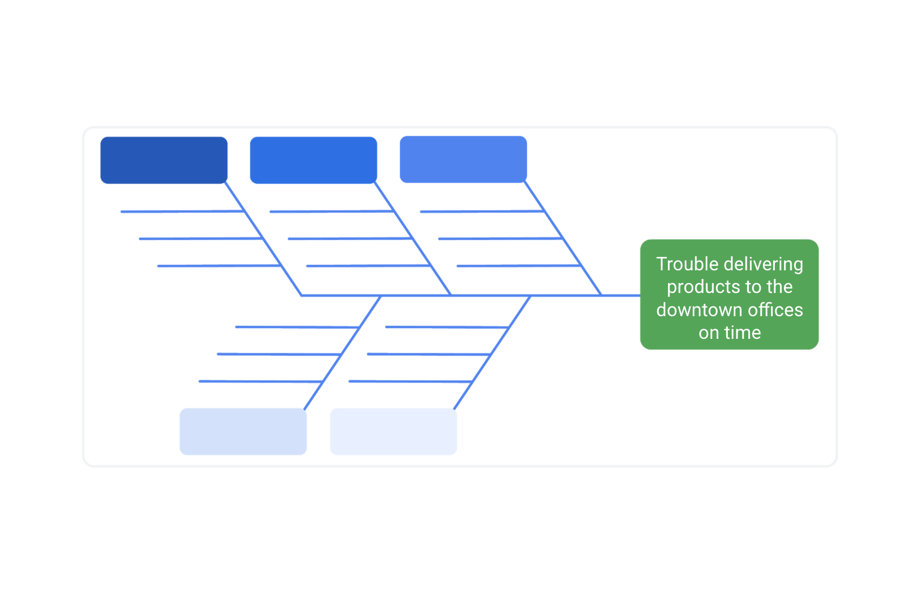
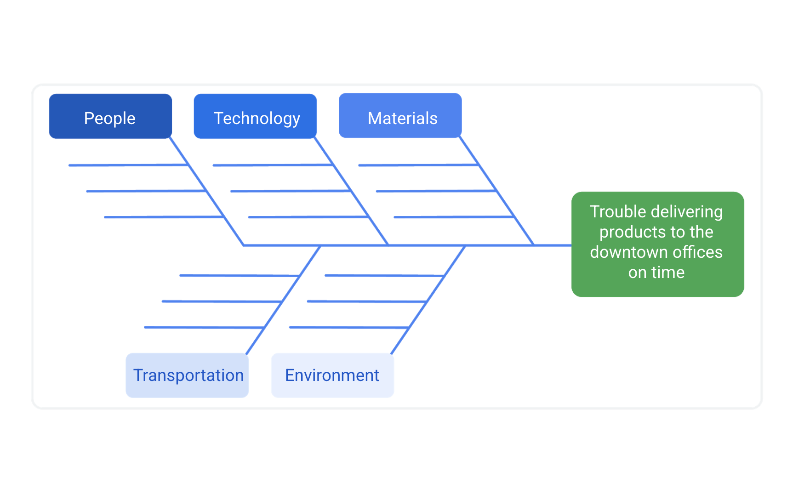
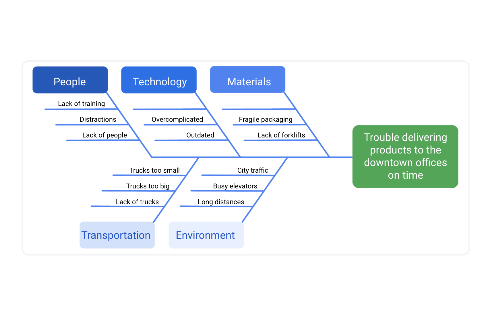
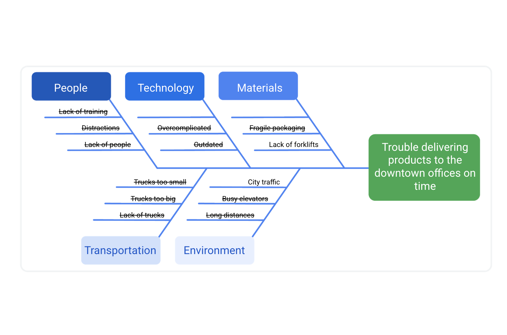
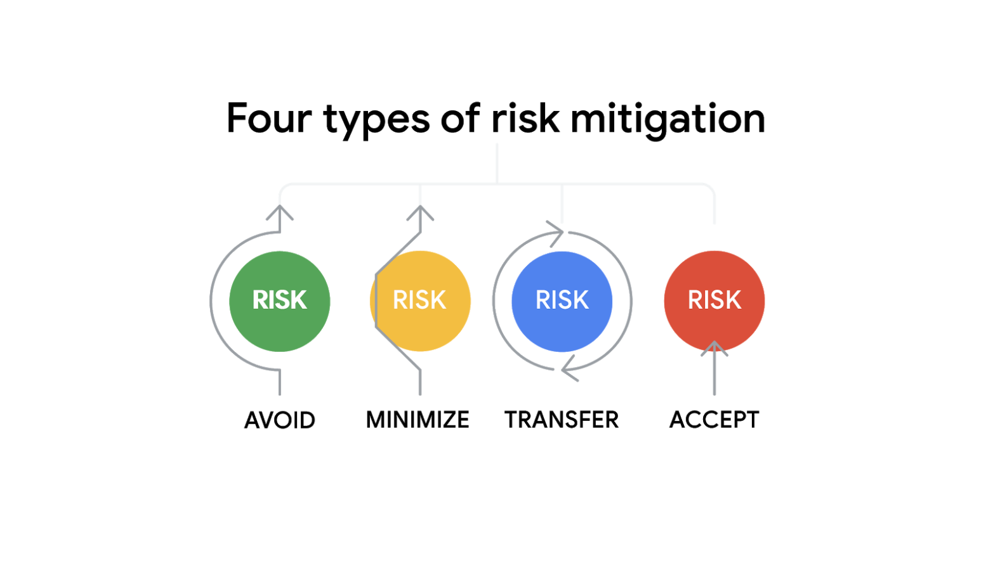

## Index
[Project Life Cycle](#the-project-life-cycle)
[Learning Organizations Culture](#learning-organizations-culture)
[Change Management](#change-management)

## The project life cycle

#### Initiate the project
In this phase, ask questions to help set the foundation for the project, such as:

- Who are the stakeholders?
- What are the client’s or customer’s goals?
- What is the purpose and mission of the project?
- What are the measurable objectives for the team?
- What is the project trying to improve? 
- When does this project need to be completed? 
- What skills and resources will the project require? 
- What will the project cost? What are the benefits?

more info [here]()

#### Make a plan
In this phase, make a plan to get your project from start to finish. 

Create a detailed project plan. 
- What are the major milestones? 
- What tasks or deliverables make up each milestone?  

Build out the schedule so you can properly manage the resources, budget, materials, and timeline. Here, you will create an itemized budget.

#### Execute the project
In this phase, put all of your hard work from the first two phases into action. 
- Monitor your project team as they complete project tasks. 
- Break down any barriers that would slow or stop the team from completing tasks. 
- Help keep the team aware of schedule and deliverable expectations.
- Address weaknesses in your process or examine places where your team may need additional training to meet the project’s goals.
- Adapt to changes in the project as they arise.

#### Close the project
In this phase, close out the project.

- Identify that your team has completed all of the requested outcomes. 
- Release your team so they can support other projects within the company.
- Take time with your team to celebrate your successes! 

Pass off all remaining deliverables and get stakeholder approval.

Document the lessons you and your team learned during the project.

Reflect on ways to improve in the future.

Key takeaway
Each phase of the project life cycle has its own significance and reason for existing. By following the project life cycle, you’re ensuring that you are: 
- Capturing the expectations of your customer
- Setting your project up for success with a plan
- Executing project tasks and addressing any issues that arise 
- Closing out your project to capture any lessons learned 

## Learning Organization's Culture

It is important to learn about the culture of the organization where you work or want to work. Understanding the company’s culture can help you navigate your team through a project. Consider this quote from Peter Drucker, an expert on management: "Culture eats strategy for breakfast." Drucker is implying that the culture of a company always influences its success, regardless of how effective the company’s business model may be.

#### Ask questions
You can learn about an organization's culture by asking questions of management and peers. It can be helpful to ask these questions in the interview phase to better understand the company’s culture before accepting a position. You might want to ask questions about:

#### Atmosphere
- What is the company’s dress code? 
- How do people typically share credit at this company? 
- Is risk-taking encouraged, and what happens when people fail?
- How do managers support and motivate their team?
- How do people in this role interact with customers and users?
- When and how do team members give feedback to one another?
- What are some workplace traditions?
- What are some of the ways the company celebrates success?

#### Policies
- What are the policies around sick days and vacation?
- Does the company allow for employee flexibility (e.g., working from home, flexible working hours)?
- What policies are in place that support employees sharing their identity in the workplace?

#### Processes
- What is the company’s onboarding process?
- How do employees measure the impact of their work?

#### Values
- What are the company’s mission and value statements?
- How might the person in this role contribute to the organization’s mission?
- How does the organization support professional development and career growth?

#### Listen to people’s stories
Listening to what current employees have to say and how they portray the company will give you great insight.

- What were employees' experiences with similar projects in the past? 
- What can they tell you about key stakeholders and customers? 

#### Take note of company rituals
Rituals can be powerful drivers of culture. They engage people and help instill a sense of shared purpose and experience. 

- How are birthdays and holidays celebrated? 
- Do employees generally eat lunch at the same time and in the same place? 

Watch employee interactions: Observing how employees interact can help you tailor your interaction style to the company norm. 
- Are employee interactions more formal or informal in nature? 
- Are ideas solicited from employees in different roles? 

## Change management
Your project’s success depends on the adoption and acceptance of your project—whether that entails the launch of a new external tool or a process that will change operations at a production facility. In both cases, the greatest impact of the change will be on the people who use and interact with the product or process that is changing. 

Change management is a major undertaking and a project in and of itself. When it comes to change management, you may not always be responsible for leading and planning the entire end-to-end process. There will be times when your manager, a team member, or another senior leader might be responsible for taking on that transition and successfully implementing the changes. However, although you may not be the one directly leading the change, there are still ways in which you can support and participate in the successful adoption of your project. 

When you are thinking about change management as it relates to your project, begin by asking yourself the following questions:

- How will the organization react to change?
- Which influencers can affect change?
- What are the best means of communication? 
- What change management practices will lead to the successful implementation of my project? 

The answers to these questions will help you prepare for a variety of possible scenarios and allow you to craft solutions to effectively support the adoption of your project. 

#### Be proactive.
 
Proactive and inclusive change management planning can help keep any potentially impacted stakeholders aware of the upcoming changes.

- Incorporate change management into your project management steps. For example, you can schedule time during team meetings or create a feedback document to ensure that your team members know there is a place to voice their suggestions and concerns

- You can also plan steps towards the end of your project to introduce the deliverable to stakeholders in the form of demonstrations, question and answer forums, or marketing videos. You can factor all of these decisions into your plan so that any potential changes are less likely to impact your timeline. If these steps have not been built into your plan, you can escalate and stress the importance of a change management plan to your stakeholders. 

#### Communicate about upcoming changes. 

Communication should occur regularly among impacted stakeholders, the change management team, and the project team. Check in and communicate throughout the project about how the changes will provide a better experience for end users of the project deliverables. In this way, you support the process by providing everyone with the information they need to feel prepared to adjust to changes once the project is ready to launch. 

#### Follow a consistent process. 
Following a clear change management process helps maintain consistency each time there is a change. The change management process should be established and documented early on in your project to guide how the project will handle change. Your organization may also have an overarching change management plan that can be adopted for your project. This may include when the promotion of the change should happen, when training should occur, when the launch or release will occur, and corresponding steps for each phase of the process. 

- Feedback mechanisms, such as surveys, can capture input from stakeholders.

- [Flowcharts](https://www.lucidchart.com/pages/what-is-a-flowchart-tutorial) can visualize the project's development process.

- [Culture mapping](https://www.strategyzer.com/library/the-culture-map-a-systematic-intentional-tool-for-designing-great-company-culture) can illustrate the company's culture and how the company's values, norms, and employees behavior may be affected by the change.

As the project manager, you are responsible for successfully delivering projects. As you hone the skill set you acquire throughout this program, you will find that change management is essential to your projects’ success.

For more on how to participate in the change management process, check out the following resources:

- [Change Management at the Project Level](https://www.prosci.com/blog/change-management-at-the-project-level)
- [5 Steps to Successful End-User Adoption](https://www.prosci.com/blog/change-management-at-the-project-level) 
- [Change Management Framework](https://www.prosci.com/blog/change-management-at-the-project-level)

- [Presentation](https://www.coursera.org/learn/project-management-foundations/supplement/fHd1o/a-project-managers-role-in-change-management) 

## Corporate and project governance

Governance in business is the management framework within which decisions are made and accountability and responsibility are determined. In simple terms, governance is understanding who is in charge.

### Corporate governance
Each organization is governed by its own set of standards and practices that direct and control its actions. Those standards and practices are called corporate governance, and they will influence your projects. 

### Project governance
Project governance is the framework for how project decisions are made. Project governance helps keep projects running smoothly, on time, and within budget. Project governance involves all the key elements that make a project successful. It tells you what activities an organization does and who is responsible for those activities. Project governance covers policies, regulations, functions, processes, procedures, and responsibilities. 

### How project and corporate governance intersect
Project governance needs to be tailored to your organization's specific needs. These needs will influence how you implement and monitor the governance framework on your project. Project governance concerns those areas of corporate governance that are specifically related to project activities. Effective project governance ensures that an organization’s projects are aligned to the organization’s larger objectives, are delivered efficiently, and are sustainable. This includes:

- Considering the long- and short-term interests of your organization
- Making thoughtful decisions about which projects to take on and avoiding projects if you do not have sufficient resources
- Providing timely, relevant, and reliable information to the board of directors and other major stakeholders 
- Eliciting the input and buy-in of senior managers since they are the decision-makers 
- During the initiation phase, prioritizing clear, reachable, and sustainable goals in order to reduce confusion and conflict
- During the planning phase, assigning ownership and accountability to an experienced team to deliver, monitor, and control the process 
- During the execution phase, learning from mistakes and adapting to new or improved knowledge

# 1. Project Initiation 

## 1.1 Performing a cost-benefit analysis
Cost-benefit analysis is the process of adding up the expected value of a project—the benefits—and comparing them to the dollar costs. In this reading, we will discuss the benefits of conducting a cost-benefit analysis, guiding questions to help you and your stakeholders conduct one, and how to calculate return on investment (ROI).

### The benefits of a cost-benefit analysis
A cost-benefit analysis can minimize risks and maximize gains for projects and organizations. It can help you communicate clearly with stakeholders and executives and keep your project on track. Because this type of analysis uses objective data, it can help reduce biases and keep stakeholder self-interest from influencing decisions. 

Comparing a project’s benefits to its costs can help you make a strong business case to stakeholders and leadership and ensure your organization pursues the most profitable or useful projects. Organizations use cost-benefit analysis to reduce waste and invest their resources responsibly.

### Guiding questions for a cost-benefit analysis
When you’re pursuing a project, the benefits should outweigh the costs. It’s important for you and your stakeholders to consider questions like the ones that follow early on, while you prepare the proposal.

To determine the benefits of a project, you might ask:

- What value will this project create? 
- How much money could this project save our organization? 
- How much money will it bring in from existing customers?
- How much time will it save? 
- How will it improve the customer experience?
- And to determine the costs of a project, consider questions such as:
- How much time will people have to spend on this project?
- What are the one-time costs?
- Are there any ongoing costs?
- What about long-term costs? 

You might also consider questions about intangible benefits. These are gains that are not quantifiable, such as:

- Customer satisfaction. Will the project increase customer retention, causing them to spend more on the company’s products or services? 
- Employee satisfaction. Is the project likely to improve employee morale, reducing turnover? 
- Employee productivity. Will the project reduce employee’s overtime hours, saving the company money?
- Brand perception. Is the project likely to improve the company’s brand perception and recognition, attracting more customers or providing a competitive advantage?

You can also flip these questions to consider intangible costs. These are costs that are not quantifiable. For example, might the project put customer retention, employee satisfaction, or brand perception at risk?

### Calculating costs and benefits
The process of calculating costs and benefits is also called calculating return on investment, or ROI. There are many ways to determine a project’s ROI, but the easiest way is to compare the upfront and ongoing costs to its benefits over time.

In this formula, G represents the financial gains you expect from the project, and C represents the upfront and ongoing costs of your investment in the project.

- [Cost Benefit Analysis for Projects – A Step-by-Step Guide](https://www.projectmanager.com/blog/cost-benefit-analysis-for-projects-a-step-by-step-guide)
- [Cost Benefit or Benefit Cost Analysis](https://pmstudycircle.com/cost-benefit-or-benefit-cost-analysis/#:~:text=Cost%2Dbenefit%20analysis%20is%20a,during%20the%20project%20selection%20analysis)

## 1.2 Setting your project goals

SMART goals: Making goals meaningful

Specific, Measurable, Attainable, Relevant, and Time-bound (SMART) goals are very helpful for ensuring project success. As you start your career in project management, you may not directly set the project goals, but you should be able to clarify and understand them. SMART goals help you see the full scope of a goal, determine its feasibility, and clearly define project success in concrete terms. 

- Specific: The objective has no ambiguity for the project team to misinterpret. 
- Measurable: Metrics help the project team determine when the objective is met.
- Attainable: The project team agrees the objective is realistic.
- Relevant: The goal fits the organization’s strategic plan and supports the project charter.
- Time-bound: The project team documents a date to achieve the goal.

### Focusing on the "M" in SMART
Let’s take a moment to zoom in on the M in SMART, which stands for measurable. Having measurable goals allows you to assess the success of your project based on quantifiable or tangible metrics, such as dollar amounts, number of outputs, quantities, etc. Measurable goals are important because they leave little room for confusion around expectations from stakeholders. 

Not every metric will have value, so you will have to determine which metrics make sense for the project. For example, measuring how many meetings the software engineers on your project attend on a weekly basis may not be the most valuable metric for a productivity goal. Alternatively, you might measure other aspects of the engineers’ productivity, such as a particular number of features created per engineer or a specific number of issues flagged per day.

## Creating OKRs for your project

OKR stands for objectives and key results. They combine a goal and a metric to determine a measurable outcome. 

OKRs and project management
As a project manager, OKRs can help you expand upon project goals and further clarify the deliverables you’ll need from the project to accomplish those goals. Project-level OKRs help establish the appropriate scope for your team so that you can say “no” to requests that may get in the way of them meeting their objectives. You can also create and use project-level OKRs to help motivate your team since OKRs are intended to challenge you to push past what’s easily achievable. 

#### Set your objectives
Project objectives should be aspirational, aligned with organizational goals, action-oriented, concrete, and significant. Consider the vision you and your stakeholders have for your project and determine what you want the project team to accomplish in 3–6 months.

Examples:
- Build the most secure data security software 
- Continuously improve web analytics and conversions
- Provide a top-performing service
- Make a universally-available app
- Increase market reach
- Achieve top sales among competitors in the region

Strong objectives meet the following criteria. They are:
- Aspirational
- Aligned with organizational goals
- Action-oriented
- Concrete
- Significant

To help shape each objective, ask yourself and your team:
- Does the objective help in achieving the project’s overall goals?
- Does the objective align with company and departmental OKRs?
- Is the objective inspiring and motivational?
- Will achieving the objective make a significant impact?

#### Develop key results
Next, add 2–3 key results for each objective. Key results should be time-bound. They can be used to indicate the amount of progress to achieve within a shorter period or to define whether you’ve met your objective at the end of the project. They should also challenge you and your team to stretch yourselves to achieve more.

Examples:
- X% new signups within first quarter post launch
- Increase advertiser spend by X% within the first two quarters of the year
- New feature adoption is at least X% by the end of the year
- Maximum 2 critical bugs are reported monthly by customers per Sprint
- Maintain newsletter unsubscribe rate at X% this calendar year

Strong key results meet the following criteria:
- Results-oriented—not a task
- Measurable and verifiable
- Specific and time-bound
- Aggressive yet realistic

To help shape your key results, ask yourself and your team the following:
- What does success mean?
- What metrics would prove that we’ve successfully achieved the objective?

Resources:
Understanding the Unique Utility of OKRs vs. SMART Goals
- [Google’s OKR playbook](https://www.smartsheet.com/content/okr-vs-smart-goals)
- [Planning company goals](https://help.asana.com/hc/en-us/articles/17965094839067-Plan-and-manage-company-goals)
- [OKRs and SMART goals: What's the difference?](https://www.whatmatters.com/resources/okrs-smart-goals-difference-between)
- [OKRs and KPIs: What They Are and How They Work Together](https://www.reflektive.com/blog/okrs-and-kpis-what-they-are-and-how-they-work-together/)
- [How OKR and project management work together](https://www.perdoo.com/resources/blog/okr-and-project-management)
- [OKR Examples](https://business.adobe.com/blog/basics/okr-examples)
- [OKR TED Talk video (John Doerr, the founder of OKRs, explains why the secret to success is setting the right goals.)](https://www.youtube.com/watch?v=L4N1q4RNi9I)

**Share your OKRs with your team.** Once you’ve created OKRs for your project, it’s important to communicate them to your team so that everyone knows how to focus and align their efforts. You can do this by sharing a digital document, presenting them in a meeting, or adding them to an internal website. OKRs can help your project team stick to its goals, monitor which are falling short, and be continuously motivated to meet project objectives. 

##### Measuring progress
Measuring your OKRs is an important part of tracking and sharing your progress. One shortcut to determining the status of a project is to score or grade your OKRs. While scores or grades don’t provide a complete assessment of a project’s success, they’re helpful tools for determining how close you came to achieving your objectives. You can then share your OKR scores with project stakeholders and team members as part of your overall project updates.

Determine how you will score your OKRs. OKRs can be scored in different ways. You can score based on a percentage of the objective completed, the completion of certain milestones, or a scale of 1 to 10, for example. You can also use a “traffic light” scoring approach, where red means you didn’t make any progress, yellow means you made some progress, and green means you completed your objective.

The simplest approach to scoring OKRs is the “yes/no” method, with “yes” meaning you achieved your objective and “no” meaning you didn’t. Using this approach, a key result such as “Launch a new widget marketing campaign” might be graded a 1 or 0 depending on whether it was launched (1) or not (0). 

## 1.3 Gathering information to define scope
Define project scope status and differentiate in-scope, out-of-scope, and scope creep factors that affect reaching the project goal

Asking scope-defining questions
Imagine that while working in a restaurant management group, your manager calls and asks you to “update the dining space,” then quickly hangs up the phone without providing further instruction. In this initial handoff from the manager, you are missing a lot of information. How do you even know what to ask?

Let’s quickly recap the concept of scope. The scope provides the boundaries for your project. You define the scope to help identify necessary resources, resource costs, and a schedule for the project. 

In the situation we just described, here are some questions you might ask your manager in order to get the information you need to define the scope of the project:

#### Stakeholders
- How did you arrive at the decision to update the dining space? 
- Did the request originate from the restaurant owner, customers, or other stakeholders? 
- Who will approve the scope for the project? 

#### Goals
- What is the reason for updating the dining space? 
- What isn't working in the current dining space? 
- What is the end goal of this project? 

#### Deliverables
- Which dining space is being updated? 
- What exactly needs to be updated? 
- Does the dining space need a remodel? 

#### Resources
- What materials, equipment, and people will be needed? 
- Will we need to hire contractors? 
- Will we need to attain a floor plan and building permits? 

#### Budget
- What is the budget for this project? Is it fixed or flexible? 

#### Schedule
- How much time do we have to complete the project? 
- When does the project need to be completed? 

#### Flexibility
- How much flexibility is there? 
- What is the highest priority: hitting the deadline, sticking to the budget, or making sure the result meets all the quality targets? 

Taking the time to ask questions and ensure that you understand the scope of the project will help reduce expenses, rework, frustration, and confusion. Make sure you understand the who, what, when, where, why, and how as it applies to the scope. If you are missing any of that information, focus your questions on those elements. The initiation phase of the project sets the foundation for the project, so ensuring that you understand the scope and expectations during this stage is essential. 

## 1.4 Strategies for controlling scope creep

### Scope management best practices
The scope of a project can get out of control quickly—so quickly that you may not even notice it. Scope creep is when a project’s work starts to grow beyond what was originally agreed upon during the initiation phase. Scope creep can put stress on you, your team, and your organization, and it can put your project at risk. The effects of scope creep can hinder every aspect of the project, from the schedule to the budget to the resources, and ultimately, its overall success. 

- **Define your project’s requirements.** Communicate with your stakeholders or customers to find out exactly what they want from the project and document those requirements during the initiation phase. 

- **Set a clear project schedule.** Time and task management are essential for sticking to your project’s scope. Your schedule should outline all of your project’s requirements and the tasks that are necessary to achieve them.

- **Determine what is out of scope.** Make sure your stakeholders, customers, and project team understand when proposed changes are out of scope. Come to a clear agreement about the potential impacts to the project and document your agreement. 

- **Provide alternatives.** Suggest alternative solutions to your customer or stakeholder. You can also help them consider how their proposed changes might create additional risks. Perform a cost-benefit analysis, if necessary.

- **Set up a change control process.** During the course of your project, some changes are inevitable. Determine the process for how each change will be defined, reviewed, and approved (or rejected) before you add it to your project plan. Make sure your project team is aware of this process.

- **Learn how to say no.** Sometimes you will have to say no to proposed changes. Saying no to a key stakeholder or customer can be uncomfortable, but it can be necessary to protect your project’s scope and its overall quality. If you are asked to take on additional tasks, explain how they will interfere with the budget, timeline, and/or resources defined in your initial project requirements. 

- **Collect costs for out-of-scope work.** If out-of-scope work is required, be sure to document all costs incurred. That includes costs for work indirectly impacted by the increased scope. Be sure to indicate what the charges are for. 

### Triple Constraints of Project Management Explained & Simplified
"Do you want fast, cheap, or good?" That's the essential question of the project management triangle, a.k.a., the triple constraints. As with an actual triangle, you can't adjust one side without impacting the others.

The triple constraints in project management are scope, time, and cost.

- **Scope:** The deliverables and activities required to achieve a project's goals.
- **Time:** The schedule required to be followed to deliver a project on time.
- **Cost:** The budget, required to limit the resources used to deliver a project.

A project can be fast, cheap or good, but it can't be all three simultaneously. Quality will suffer.

Actionable Tips For Managing The Triple Constraint 
Here's a quick visual overview and guide of how to manage the triple constraint in real life.

[source](https://thedigitalprojectmanager.com/projects/scope-management/triple-constraint/)

## 1.5 Don't forget to land: Measuring project success

You will often hear companies celebrating the launch of a new product, service, or initiative, and it is important to remember that even when your project is out in the world, your work isn’t complete. When working on a project, the goal isn’t simply to launch it, but to land it. Landings occur once your project achieves a measure of success. As project managers, landings are what we strive for and what we celebrate. They are the ultimate reward for all of our efforts. 

#### Launching vs. landing a project
In project management, a project “launching” means you have delivered the final results of the project to the client or user. You can’t solely base project success on when the client accepts the project, though. Your work on a project won’t be complete until you “land” it by thoroughly measuring the results. This is when the **success criteria** and the metrics you defined initially when setting SMART goals will come in handy.  

Teams should be clear on what they are trying to accomplish, beyond just launching something to users. Will your project increase retention? Will your project speed up a product feature? Depending on the product and situation, the answers will differ, but it is important that your team aligns and works toward the same measurable goal. 

#### Tracking and communicating success criteria

##### Product quality 
The product, or final result, of a project has its own set of attributes that define success. The product attributes that are necessary for the product’s success include completeness in features, quality of features, unit cost, usability, etc. The extent that a product is complete will contribute to the product’s success. This can apply to any project in which you deliver a product or tangible outcome at the end. To keep us on track for success, we can create a list of product requirements to ensure that you do not miss anything. For example, if the project produces word processing software, you need basic features like text entry, formatting, saving, and printing. Since you require each feature to have a functional word processor by today’s standards, you include these features on your checklist. 

To measure the success of a product, consider including these metrics on your checklist: 

- Track if you implemented the product’s priority requirements
- Track and assess the product’s number of technical issues or defects
- Measure the percentage of features you delivered or released at the end of the project

#### What is important to the customers or stakeholders 
We have to pay attention to product metrics, but we also have to be mindful of stakeholder and customer additional expectations for features and objectives. In the word processor example, a stakeholder may want to add an additional functionality to easily create tables in a document with text. Additionally, a strategic goal of the organization could be to create word processor software with more collaborative ability than the word processors currently on the market. Each component is necessary in order to meet customer and stakeholder expectations. Think about what needs the project satisfies for your stakeholders or customers. These strategic goals tie back to the business case and the reason you initiated the project in the first place. Often, you can measure the fulfillment of strategic goals via user or customer metrics. Metrics to consider include:

- Evaluating user engagement with the product 
- Measuring stakeholder and customer satisfaction via surveys
- Tracking user adoption of the product by using sales data

#### Document, align, and communicate success
Understanding where we are and where we are going helps the project team determine if they are on track. As you learned in the video on this topic, you need to get clarity from stakeholders on the project requirements and expectations. There are many people involved with any project, and success will look different for each of them. You want to ask questions, such as: 
- Who ultimately says whether or not the project is successful? 
- What criteria will be measured to determine success? 
- What is the success of this project based on? 
- It is best practice to get the key stakeholders or the steering committee to review and approve your success criteria. This becomes a mutual agreement on how all parties define the success of the project.

Success criteria template click [Here](https://docs.google.com/document/d/1E3OwXHMb25DpWHeJXzff9wqjuJSO6KH9aijNUAIUNpQ/template/preview?resourcekey=0-vgOO8PhLm_19ztOHb4eLJw)

#### Understand, assess and adapt
I believe that there needs to be a three-step approach to dealing with these situations, and the same approach can be applied whether it is your first project or if you have been managing projects for years. It’s just likely to become more of a subconscious effort with experience. Those three steps are:
1. Understand – What is the position each stakeholder has?
2. Assess – How does that position compare with the organizational view of the project?
3. Adapt – Adjust elements of the project to manage any variance between views and
perspectives.

## 1.6 The building blocks of a project dream team

Too big, too small, or just right?
Once you lay the foundation for your project by outlining your goals and expectations, it is time to build your dream team! Though before we can build our dream team, we need to figure out how many people we need. This number will largely depend on the size of the project itself. Complex projects with large divisions of work will usually require larger project teams. Simple projects with straightforward expectations may only require a few people on the project team. 

- **Technical skills** are highly valued, but they are not the only skills that are important for high functioning teams. 

- **Problem-solving skills** are a must for all team members, especially when it comes to large, complex projects. As a project manager, you will not be able to solve every problem for your team. At some point, they will need to use their own judgment to problem-solve and get the work done. 

- An underrated skill set for project team members are leadership skills. Strong **leadership skills** help team members navigate organizational boundaries and effectively communicate with stakeholders to generate buy-in. 

##### Who is available?
In projects, the availability of your team is always a big concern. This is especially true in Matrix organizations, where team members have multiple bosses. It is not uncommon to pull a team member onto another project before your project is complete. In a perfect world, you only pick those who can stay on the project for its entire life cycle. You may find that you don’t get to pick certain members of your team at all, which is called a pre-assignment. In these cases, the sponsor assigns team members to your project

##### What motivates them?
Be sure to take note of the motivation level of your team members and the impact it may have on your project. Just because a person is pre-assigned to a project, doesn’t necessarily mean they have low interest in it, but a person who proactively volunteered for it may have additional motivation to do the work.

##### Essential project roles
- Project Manager
- Stakeholders
    - Primary stakeholders: directly affected by the outcome of the project
    - Secondary stakeholders: indirectly affected by the outcome of the project
- Project team members
- Sponsor

## 1.7 Prioritizing stakeholders and generating their buy-in

learning to complete a stakeholder analysis and explain its significance. Let’s focus here on how to prioritize the various types of stakeholders that can exist on a project, generate stakeholder buy-in, and manage their expectations

### stakeholder analysis

key steps in the stakeholder analysis:

1. Make a list of all the stakeholders the project impacts. When generating this list, ask yourself:
    - Who is invested in the project? 
    - Who is impacted by this project? 
    - Who contributes to this project? 

2. Determine the level of interest and influence for each stakeholder—this step helps you determine who your key stakeholders are. The higher the level of interest and influence, the more important it will be to prioritize their needs throughout the project. 

3. Assess stakeholders’ ability to participate and then find ways to involve them. Various types of projects will yield various types of stakeholders—some will be active stakeholders with more opinions and touchpoints and others will be passive stakeholders, preferring only high-level updates and not involved in the day-to-day. 

 **Pro tip:** You might want to form a steering committee during some projects. A steering committee is a collection of key stakeholders who have a high level of power and interest in a project. A steering committee can influence multiple departments within the organization, which means that they have the potential to release a greater number of resources to the project manager.  

#### Quadrant 1: High Influence, High Interest (Upper Right)

Stakeholders in this quadrant have a significant influence on the project and are highly interested in its outcome. They can greatly impact project decisions and success. Examples might include project sponsors, key executives, or regulatory authorities. Responses for this quadrant include:

1. Engagement and Involvement:

    - Keep these stakeholders well-informed and engaged throughout the project lifecycle.
    - Involve them in decision-making processes, seeking their input and feedback.
    - Address their concerns promptly and effectively.

2. Regular Communication:
    - Schedule regular meetings or updates to keep them informed about project progress and any issues.
    - Tailor communication to their preferences and needs to ensure they remain supportive and engaged.

#### Quadrant 2: High Influence, Low Interest (Upper Left) 

Stakeholders in this quadrant have high influence but may not be deeply interested in the day-to-day project details. They might include senior managers who need to be informed but may not be actively engaged. Responses for this quadrant include:

1. Executive Summaries:
    - Provide high-level summaries of project progress and key decisions for their review.
    - Focus on the impact of the project on organizational goals and objectives.
2. Periodic Updates:
    - Provide periodic briefings or updates to ensure they are informed of major milestones and critical project changes.

#### Quadrant 3: Low Influence, High Interest (Bottom Right) 

Stakeholders in this quadrant have a high interest in the project but relatively low influence on its outcome. They are typically looking for updates and information about the project. Responses for this quadrant include:

1. Regular Updates:
    - Communicate project progress, risks, and updates to keep them engaged and informed.
    - Address their queries and concerns promptly to maintain their interest.
2. Stakeholder Feedback:
    - Seek their feedback on project plans, progress, and outcomes to ensure their perspective is considered.

#### Quadrant 4: Low Influence, Low Interest (Bottom Left)

Stakeholders in this quadrant have low influence on the project and limited interest in its details. They might include lower-level employees or departments not directly impacted by the project. Responses for this quadrant include:

1. General Communication:
    - Share general updates about the project's overall progress without overwhelming them with details.
    - Address any specific questions they may have, but avoid unnecessary inundation with project-related information.
2. Minimal Engagement:
    - Maintain a basic level of communication and engagement to keep them aware of the project without distracting them from their regular responsibilities.

**Pro tip:** While these tools help organize information, they do not necessarily make the difference between successful and unsuccessful stakeholder engagement. What will make for successful stakeholder engagement is the project manager’s ability to know their stakeholders’ motivations and inspirations. This takes time, interpersonal skills, and insight into the organization’s internal political workings. Remember, each project is different, and your project may need tweaks along the way as you grow as a project manager. Making necessary changes means you are doing something right. Just make sure to check in and ensure that you are well on track, engaging your stakeholders successfully, and delivering on your project!

#### Generating stakeholder buy-in 
Once you organize and assess your stakeholders, it is time to start making some decisions on whose buy-in is absolutely necessary for success, whose requirements deserve the most attention, and what level of communication each stakeholder will require.

Gaining key stakeholder buy-in is essential to ensuring that your project is not deprioritized or deprived of resources. 

Tips for gaining key stakeholder buy-in include: 

- Clearly mapping the work of the project to the goals of the stakeholder.
- Describing how the project aligns with the goals of the stakeholder's department or team.
- Listening to feedback from the stakeholder and finding ways to incorporate their feedback into the project's charter where appropriate.

Manage your stakeholders’ expectations by presenting a realistic view of your team’s abilities. Do not over-promise and under-deliver! 

## 1.8 Building out a RACI chart
A RACI chart can be an extremely effective way to define project roles, give direction to each team member and stakeholder, and ensure work gets done efficiently. Having a RACI chart available throughout the duration of your project as a quick visual can be invaluable.

#### When should you use a RACI chart?
If you are wondering if you should use a RACI chart on your project, it is a good idea to evaluate the complexity of the effort. For example, if you have a very small project team with a small number of stakeholders, clearly defined roles, and a short timeline, introducing a RACI chart could possibly slow down the project. However, larger projects, or even projects that involve a large number of stakeholders, could greatly benefit from a RACI chart. It is always a good idea to work through the creation of a RACI chart and evaluate the outcome. Even if you do not end up using the RACI chart, you will have a better understanding of the project, and your effort will contribute to your project management experience overall.

#### Elements of a RACI chart
A RACI chart creates clear roles and gives direction to each team member and stakeholder. Over your career, you may hear a RACI chart referred to as a Responsibility Assignment Matrix (RAM), RACI diagram, or RACI matrix. The ultimate goal of this chart is to clarify each person’s role on your project. 

First, let’s break down each of the roles people can be assigned:

    R: Responsible: who gets the work done
    A: Accountable: who makes sure the work is done
    C: Consulted: who gives input or feedback on work
    I: Informed: who needs to know the outcome

#### Responsible
Individuals who are assigned the “responsible” role for a task are the ones who are actually doing the work to complete the task. Every task needs at least one responsible party. It’s a best practice to try to limit the number of team members assigned to a task’s  responsible role, but in some cases, you may have more than one. 

A couple of questions to ask yourself when determining which person or people should be placed in the responsible role for a given task are:

- What department does the work fall under?
- Who will perform the work?

It is helpful to evaluate the people on your team to determine the role that suits them. Remember that you may need to list roles rather than names, if some people take on more than one role. 

Let’s dig deeper into our example with Office Green. Our task is to develop price points for the project, and the Financial Analyst will complete the work for this task. Therefore, we will list “Financial Analyst” in the responsible role for this task in the RACI chart.

A section of a RACI chart, where the Financial Analyst is in the "responsible" role

#### Accountable
The “accountable” person is responsible for making sure the task gets done. It is important to have only one individual accountable for each task. This helps clarify ownership of the task. The accountable person ultimately has the authority to approve the deliverable of the responsible party. 

In order to determine who should be tagged as the accountable team member, consider:

- Who will delegate the task to be completed?
- Who will review the work to determine if the task is complete?

You may encounter a situation where the responsible party is also accountable, but where possible, it is helpful to separate these roles. Ensuring that accountability is not shared ensures that there is no confusion on who the ownership belongs to.

#### Consulted
Team members or stakeholders who are placed in the “consulted” role have useful information to help complete the task. There is no maximum or minimum number of people who can be assigned a “consulted” role, but it’s important that each person has a reason for being there.

Here are a few ways you can help identify who is appropriate for the role:

- Who will the task impact?
- Who will have input or feedback for the responsible person to help the work be completed?
- Who are the subject matter experts (SMEs) for the task?

The consulted people will be in frequent, two-way communication with the responsible party, so it is key to make sure that the right people are in this role to help accomplish the task efficiently and correctly.

Back to the project at Office Green, we’ve got a “responsible” Financial Analyst and an “accountable” Head of Finance. Who else would need to provide input on the product’s price points? Whose decisions and feedback will directly affect the task? The Director of Product will need to be consulted on the matter, as they oversee all product offerings. This person will have information about potential changes to the product and how these changes might affect price points.

 #### Informed 

 Individuals who are identified as needing to be “informed” need to know the final decisions that were made and when a task is completed. It is common to have many people assigned to this category and for some team members to be informed on most tasks. Team members or stakeholders here will not be asked for feedback, so it is key to make sure people who are in this group only require status updates and do not need to provide any direct feedback for the completion of the effort. 

Key questions to ask yourself in order to ensure that you have appropriately captured individuals in the “informed” role are:

- Who cares about this task’s completion?
- Who will be affected by the outcome?

Now that you’ve determined who is responsible, accountable, and consulted on the Office Green project task, it is time to determine who needs to be informed about the task. Your Financial Analyst has set the price points with input from the Director of Product, and the Head of Finance has approved. You will now need to inform the Sales Team about the final price points, as they will need this information to sell the product. 

**Pro tip:** You could end up with a large number of team members and stakeholders who are placed in the “informed” role. If so, make sure that you have a plan to keep them informed that is not labor-intensive. Something as easy as view-only access to your project plan or meeting notes could prevent you from having to create separate communications along the way.  

##### Key takeaway RACI 
The RACI chart is a valuable tool. It can help you define and document project roles and responsibilities, give direction to each team member and stakeholder, and ensure work gets done efficiently. A RACI chart can also help you analyze and balance the workload of your team. While it may take many revisions to make sure that your team members and stakeholders are being placed into the right roles in your RACI chart, doing this work up front helps save time and prevent miscommunications later on. 

Example

#### Workload balance 
Are there too many tasks assigned to one stakeholder? When you complete your chart, it is a good idea to go back through and tally the number of Rs assigned to each stakeholder. This can help you identify potentially overloading one team member with work. Using a RACI chart to determine responsibility for tasks can help mitigate single points of failure (known as creating silos, where the knowledge and responsibility for a task falls on one person) and allow you, as the project manager, to delegate tasks and avoid burnout. Maintaining workload balance is a critical part of project management. It is easy to fall into the pattern of relying on your top performers to keep the project moving forward. But this isn’t always healthy for the project or your team. If you find that you don’t have the right people to assign responsibilities to, take a step back and evaluate your team. 

##### Put your RACI into practice
Once you have created your RACI chart, it is time to put it into practice. You will first need to share your RACI chart with your sponsors and stakeholders to get buy-in and sign-off. When you get stakeholder buy-in, you will be able to set clear expectations for your team and ensure that everyone is aligned on their responsibilities. 

You can document your team and stakeholders’ acknowledgment of these expectations through the project charter, meeting notes, and in the RACI chart itself. Think back to a time when you were expected to do something you did not agree with, or weren’t clear on. That disagreement or lack of clarity made it difficult to do your best work, right? Getting buy-in and continually checking in with your stakeholders and your team is the way to avoid this potential pitfall! 

As you take the time to ensure that each task has an owner identified with the appropriate level of engagement, you are streamlining your communication and decision-making process over the life cycle of your project. 

## 1.9 Why Projects fail: Initiation missteps

You have been learning the necessary planning steps to take in order to set a project up for success. But despite your best efforts, projects can still fail. Sometimes the factors that lead to project failure are out of your control. The technology to complete the project is unavailable, for example, or a stakeholder decides to drastically change the goals of the project. However, there are factors that can lead to failure that are more in your control, such as being unable to complete the project deliverables within the agreed upon time or being unable to fulfill the stakeholder’s vision for the project.

#### 1. Unclear expectations 
You may remember the questions you need to answer at the start of the initiation phase of the project, including: 

- What is the end goal? 
- What are the expected deliverables and schedule? 
- What is the budget? 
- Who are the stakeholders? 

Not taking the time at the beginning of a project to ask essential questions, document decisions, and understand the true scope of the project may lead to failure. After all, without directions, you can never reach your destination. 

#### 2. Unrealistic expectations
We all like to impress our managers, but sometimes, we accidentally agree to unrealistic expectations and set our projects up for failure from the start. For example, if a project is expected to take two weeks due to the level of detail and effort required but we try to complete it in one week, we will not have the resources available to meet the consolidated schedule. This will likely result in quality issues. It’s important to understand the requirements of a project before agreeing to any deadlines. As a best practice, don't commit to firm dates when initiating the project to avoid setting unrealistic expectations. You will have more information and will be able to better manage expectations in the planning phase.

#### 3. Miscommunication
Clear communication is key. If information is not communicated in a timely manner, does not include pertinent information (risks, decisions made, scope changes, etc.), or is not sent to the correct stakeholders, then you may be setting yourself up for failure. Conducting a stakeholder analysis and then utilizing a RACI chart to understand which stakeholders should be kept informed or consulted is a great start to creating an effective communication strategy.

As a project manager, you do not necessarily have to cater to everyone’s unique communication styles, but you do have to set expectations about how communication will occur. As you are kicking off a project, make sure you take some time to understand the communication needs of your team and stakeholders. Some people dislike emails and would prefer to have a phone conversation, some prefer to have communication in writing, and some prefer face-to-face meetings. A strong communication system incorporates all of these methods. Set expectations for your communication approach early so that you, your team members, and your stakeholders have a clear understanding of how you will all communicate.

#### 4. Lack of resources
Resources include your team members, budget, and materials. Unfortunately, without proper planning, your resources can quickly be over-tasked or depleted. Sometimes project managers don’t account for the fact that team members are juggling multiple tasks and may not be able to devote the time necessary to complete all of their assigned tasks correctly and on time. Or, project managers may not realize that a specific skill set is required to complete certain tasks. Ensuring that the right team members are available at the right time is crucial.

Another common error is to incorrectly calculate your project expenses. For example, imagine you have a project budget of $10,000. If your project requires $10,000 for materials and you also have to ship and install those materials, then you will not have enough money to complete your project. Clarify your resource needs and confirm their availability with leadership up front to avoid delays or issues further along in the project. 

#### 5. Scope creep 
The scope provides an overarching framework of what is and is not included in the project’s work and deliverables. Defining the scope in the initiation phase helps identify the resources needed, the cost associated with those resources, and the schedule required to complete the work. Sometimes projects fail because the scope of the project grows and impacts to the scope are not captured. 

For example, imagine that you are given a project that originally includes three deliverables. During the course of the project, a stakeholder requests that two additional deliverables be included, but no changes are made to the schedule, budget, or team members to reflect the impact of the increased number of deliverables. As a project manager, when deliverables change, you have to make sure that you are capturing the potential impact of those changes to the schedule, budget, and quality. This is why it is so important to make sure that everything is documented in the initiation phase. Have a plan for how to handle scope creep if it occurs, and clarify who has the authority to approve scope changes.

#### 6. Siloed Teams
A promising initiative in product packaging design and printing ended in failure, primarily due to siloed teams. The downfall of this important work resulted from isolated departments operating independently, unaware of each other’s progress, goals, and challenges. The once-integrated vision fractured into disjointed efforts, leading to a project that crumbled under the weight.

#### 7. Lack of leadership
The primary reason behind the failure was the leadership vacuum. The absence of a decisive, visionary leader left the team without a north star, resulting in a rudderless ship navigating turbulent waters. Critical decisions were delayed or went unmade, and the project meandered aimlessly, eventually spiraling into a state of disorganized incompleteness.

#### Key takeaway 
Taking the time to clarify expectations—particularly around communication methods, resources available, and scope—during the initiation phase will increase the chances of your project’s success. Even if you follow these best practices, you may still encounter failure. Remember that in every failure, there is the opportunity to learn, grow, and do better the next time.

[Failed projects article](https://project-management.com/7-lessons-to-learn-from-a-failed-project/)

## 1.10 Project charters: Elements and formats

A project charter clearly defines the project and outlines the necessary details for the project to reach its goals. A well-documented project charter can be a project manager’s secret weapon to success. In this reading, we will go over the function, key elements, and significance of a project charter and learn how to create one. 

The charter is the formal way that the project’s goals, values, benefits, and details are captured. You can think of the charter as the compass for your project since you will use it throughout the life cycle of the project. Many stakeholders will look to your project charter to ensure that you are indeed aligned with strategic goals and set up for achieving the desired end goal. Since the project charter carries so much importance, it is important to incorporate the right amount of detail while omitting miscellaneous elements.

As with any of your project documents, it is a good idea to collaborate with your team and stakeholders early and often. Developing the project charter in collaboration with both groups can help you make sure that your project charter addresses your key stakeholders’ most important concerns and keeps your team aligned. Be sure to use the business case—the reason for initiating the project—as the guiding direction to your project charter. Project charters can vary from organization to organization and from project to project. It is key for a project manager to identify the best type of charter for the project in order to capture the relevant information and set your project up for success. 

Project charters will vary but usually include some combination of the following key information:

- introduction/project summary
- goals/objectives 
- business case/benefits and costs
- project team
- scope
- success criteria
- major requirements or key deliverables
- budget
- schedule/timeline or milestones
- constraints and assumptions
- risks
- OKRs
- approvals

You will likely use many different project charter formats throughout your project management career. One example is a condensed, simplified document, like the one you'll learn about in the upcoming video and the one linked in the activities. A short and simple project charter can be used on smaller projects that are not very complex. 

For more complex projects, you may link to additional analysis or documents. You can house these items in the appendix. 

Your organization may have a unique template for you to use, or you may have the flexibility to leverage one you come across in your career. As your project progresses, you may also encounter revisions to your project charter—and that is okay. Remember, it is a living document; let it grow with your project, and review and revisit it often to ensure you are aligned. 

## 1.11 Introducing new tools to a team

Project management tools and processes are always evolving. In this reading, we will discuss the importance of choosing the right tools for a project and the implications of introducing new tools to your team. 

As a project manager, it is important to be open to implementing new tools that may be beneficial to a project's outcome. You will experience change in lots of forms throughout your project’s life cycle, and navigating change is essential. But if you choose to implement a tool that your team is unfamiliar with—especially if you decide to roll it out midway through a project—your team may be hesitant. People embrace change differently, particularly if the change will directly impact their routine and the way they work. Simply put: Change can be met with resistance.

Before you introduce a new tool to your team, you should be sure that this change is actually going to benefit the project, and ensure that those involved in your project understand the benefits of this change. Demonstrating to your teammates and stakeholders that you understand the tool and have evaluated its competency will help build trust, especially if this new tool is replacing an existing tool. Taking the time to introduce the new tool to your team members will also demonstrate that you have the best interest of the team in mind—not just the success of the project. 

Here are some important considerations and keys to successfully introducing new tools:

- **Discuss the tool early and often, if possible.** The team should not feel blindsided by a new change. Make sure they know the change is coming as early as possible. This will help them prepare for an introduction or migration to the new tool.

- **Ask for feedback from key stakeholders.** You could get great feedback on features that you may have overlooked by asking for their expertise. You can solicit this feedback by requesting their input about functionality or have them list features in order of priority. The key is to create an opportunity for stakeholders to provide their feedback and allow you to incorporate their feedback into next steps.

- **Involve the key stakeholders in demonstrations as you get closer to making the final decision on the project tracking tool.** You will be able to leverage key stakeholders' acceptance by letting them test the product or sign up for a trial run. It is also important to make sure that the tool is actually going to meet the mark and provide a meaningful change for the project. You may want to pull in key users from your team to test and familiarize themselves with the tool prior to rolling it out. This will allow the team to get on board with your plans or discuss their concerns beforehand. This will also highlight in-house experts for future training, assistance, and implementation.

- **Ensure the tool is fully functional before the team is introduced to it.** Whenever possible, hold off from introducing the tool if it still has any issues. Make sure the tool is accessible for all users. Keep in mind, your team members may resist a tool that doesn’t live up to how it is supposed to function. This will impact implementation and acceptance fairly significantly, so put your best tool forward!

- **Set up training for the tool as needed before you ask the team to actually use it.** Everyone has different levels of comfort with different tools. It is your job as the project manager to ensure that each team members’ needs are addressed. Setting up training also helps create positive first impressions, which will lead to higher productivity and quicker, more successful implementation and acceptance.

Remember, some pushback is normal, but successful project managers should take the steps to prepare and mitigate any friction for their team when possible. 

**Pro tip:** If time allows, plan for a period of transition if you are replacing an existing tool. It is common to allow both tools to operate during this period. You will need to “sunset,” or retire, the existing tool eventually, but allowing for a period of transition between using the old tool and the new tool can help stakeholders and team members feel more at ease and give them time to gain familiarity with the new tool. Be prepared for productivity to be impacted as the team transitions from one tool to another.

# 2. Putting it all together 

## 2.1 Tips for leading a successful kick-off meeting

A kick-off meeting is the first meeting among the project team, stakeholders, and the project sponsor at the start of a new project or new project phase. The purpose of a kick-off meeting is to ground everyone in a shared vision, ensure they understand the project’s goals and scope, and make sure that they are all on the same page about their roles and responsibilities on the project. The kick-off meeting is critical to a project’s overall success. It gets the team together to align on goals and visions for the project and sets the project up for success.

#### Kick-off meeting best practices
Set the right time. Choose a meeting time that works for everyone. Be mindful of time zone differences. 

- **Set the right length.** Choose an appropriate meeting length—no more than one hour. You don’t want to waste people’s time, but you also don’t want to run out of time. Kick-off meetings work best when you first share key information and then spend any additional time on questions and team building.

- **Invite the right people.** Be strategic about including the appropriate people. The goal is to invite attendees who play a role in the development and execution of the project, such as all team members, stakeholders, and the project sponsor. You don’t want to leave anyone out, but you also don’t want to invite people who shouldn’t be there.

- **Designate a note taker.** The discussion that takes place during the meeting is important. It is critical that you document any feedback, changes, or questions asked by attendees. If you are leading the meeting, designate someone else to take notes before the meeting starts. You can also use tools like Chorus Notetaker, Google Keep, Google Docs, or Microsoft OneNote.  

- **Set the agenda.** To recap what we discussed in the video, a kick-off meeting agenda should generally include: introductions, the project background and purpose, project goals and scope, roles and responsibilities, the collaboration process and project tools, what comes next (expectations and action items), and time for questions and discussion.

- **Share the agenda.** Prior to the meeting, share the agenda with attendees via email and identify speakers for each topic. By sending the agenda in advance, everyone will have an idea of what to expect, time to prepare for anything they may need to present or discuss, and time to generate questions or ideas.

- **Stick to the agenda.** During meetings, discussions can sometimes go off topic or take longer than expected. As a project manager, it is your job to keep the meeting on track by redirecting discussions to the items on the agenda. 

- **Follow up after the meeting.** After the meeting, make sure to send out a meeting summary featuring the meeting notes and any action items. 

## 2.2 Setting milestones: Best practices

You have learned what milestones and tasks are and when, where, and how you will use them as a project manager. In this reading, we will explore best practices for setting milestones. But first, let’s revisit the definitions of tasks and milestones. 

- A **project task** is an activity that needs to be accomplished within a set period of time and is assigned to one or more individuals for completion. The work of a project is broken down into many different project tasks. 

- A **project milestone** is an important point within the project schedule that usually signifies the completion of a major deliverable. Milestones are significant checkpoints in your project, and keeping track of them helps ensure that your project is on schedule to meet its goals.

#### Set tasks to identify milestones
Setting tasks can help you clearly define milestones. You can do this in two ways:

1. **Top-down scheduling:** In this approach, the project manager lays out the higher-level milestones, then works to break down the effort into project tasks. The project manager works with their team to ensure that all tasks are captured.

2. **Bottom-up scheduling:** In this approach, the project manager looks at all of the individual tasks that need to be completed and then rolls those tasks into manageable chunks that lead to a milestone. 

Most projects have many tasks that lead to milestones. For instance, if your milestone is to receive approval on the first draft of an article that you are writing, you might complete tasks such as “develop outline,” “write first draft,” and “send to the editor.” Then, you may have another set of tasks to achieve before reaching the milestone of revising the article. Milestones serve as check-in points along your project to make sure that you are headed in the right direction toward the end goal. Milestones also make projects more manageable.

#### Integrate milestones into your project schedule
There is not a consistent number of milestones in every project. Some projects will have a few milestones, while others may have dozens. Rather than aiming to hit a certain number of milestones, try to set milestones for the most important events in your project. Review your project schedule and identify important moments or checkpoints. In other words, pinpoint where in your project you will achieve major goals and make those points your milestones. 

#### Milestone-setting pitfalls
Here are some things to avoid when setting milestones: 

- **Don’t set too many milestones.** When there are too many milestones, their importance is downplayed. And, if milestones are too small or too specific, you may end up with too many, making the project look much bigger than it really is to your team and stakeholders.  

- **Don’t mistake tasks for milestones.** Remember that milestones should represent moments in time, and in order to map out how you will get to those moments, you need to assign smaller tasks to each milestone.

- **Don’t list your milestones and tasks separately.** Make sure that tasks and milestones can be visualized together in one place, such as a project plan. This will help ensure that you are hitting your deadlines and milestones. 

## 2.3 Breaking down the work breakdown structure

**A work breakdown structure**(WBS) is a deliverable-oriented breakdown of a project into smaller components. It’s a tool that sorts the milestones and tasks of a project into a hierarchy, in the order they need to be completed. 

A thorough WBS gives you a visual representation of a project and the tasks required to deliver each milestone. It makes it easier to understand all of the essential project tasks, such as estimating costs, developing a schedule, assigning roles and responsibilities, and tracking progress. Think of each piece of information as part of the overall project puzzle—you can’t successfully navigate through the tasks without understanding how they all fit together. For instance, many smaller tasks may ladder up to a larger task or milestone.

#### Steps to build a WBS
As a reminder, here are three main steps to follow when creating a WBS: 

- **Start with the high-level, overarching project picture. Brainstorm with your team to list the major deliverables and milestones.** Example: Imagine you are planning a company event. Your major milestones might include categories like “secure venue,”  “finalize guest logistics,” and “establish agenda.”

- **Identify the tasks that need to be performed in order to meet those milestones.** Example: You could break a milestone like “secure venue” down into tasks like “research venues,” “tour and decorate space,” “make down payment,” and so on. 

- **Examine those tasks and break them down further into sub-tasks. ** Example: You could break down a task like “tour and decorate space” further into sub-tasks like “organize decorating committee,” “purchase decorations,” “assign decorating responsibilities,” and so on. 

[Article: How to create a work breakdown structure and why you should](https://www.lucidchart.com/blog/how-to-create-a-work-breakdown-structure-and-why-you-should)

## 2.4 Putting together the pieces of a project plan

#### Project scope and goals
Both the project scope and goals will be captured initially in your project charter, the document that clearly defines the key details of your project. You can link your project charter in your project plan. Having details about the project’s scope and goals easily accessible can help remind your team of the objectives they are trying to accomplish and if anything is asked of them that goes beyond what was initially agreed upon in order to achieve those objectives. 

#### Work Breakdown Structure (WBS)
As a reminder, a Work Breakdown Structure is a tool that sorts the milestones and tasks of a project in a hierarchy, in the order they need to be completed.  The WBS is key to your project plan since it breaks the work down into more manageable pieces. In your project plan, the tasks should be visible in one place with clear descriptions, owners, and due dates. This will allow you and your team to understand who is responsible for which tasks and when each task is supposed to be completed. Your project plan should also contain detailed milestones and statuses related to these tasks, which will help you and your team members visualize project progress. 

In addition to the WBS, further documentation—such as a RACI chart—will help define roles and responsibilities and would be useful to add to your project plan. Keeping this documentation stored or linked in one place is a best practice for transparency and effective communication.

#### Budget
Throughout the life cycle of your project, the budget will need to be managed and monitored. The project budget is often linked to the project plan because it is heavily dependent on key elements of the project. Linking these components allows for smoother management and visibility. 

Depending on the size of your project and your organization, you may not be the primary person responsible for managing the project budget. For instance, if your project is at a large organization and the funds are managed by another department, you may not have as much autonomy or insight into all of the budget elements. As a result, you may not be able to monitor the budget closely. If someone in another department is managing the budget, make sure to have regular check-ins with them to ensure that you are aware of how you are tracking.

#### Management plans
Management plans—such as the change management plan, risk management plan, and communication plan—are all integral to keeping a project organized and on track and should be linked in your project plan. These plans will be discussed in detail in the coming lessons of this course. 

## 2.5 Critical Path

The **critical path** refers to the list of required project milestones you must reach to complete the project schedule, as well as the mandatory tasks that contribute to the completion of each milestone. You can think of the critical path as a framework that tells you, the project manager, where you are, where you are headed, and when you will get there. 

#### Why the critical path is critical
The critical path helps you determine the essential tasks that need to be completed on your project to meet your end goal and how long each task will take. The critical path also provides a quick reference for critical tasks by revealing which tasks will impact your project completion date negatively if their scheduled finish dates are late or missed. A critical path can help you define the resources you need, your project baselines, and any flexibility you have in the schedule. 

#### Step 1: Capture all tasks 
When you first start working on your project schedule, you will capture all of the tasks associated with the completion of the effort. Remember to use the key planning documents you have created to get you to this point, such as your work breakdown structure (WBS). The main goal in this step is to make sure that you aren’t missing a key piece of work that is required to complete your project. When creating a critical path, focus on the essential, “need to do” tasks, rather than the “nice to do” tasks that aren’t essential for the completion of the project. Here is an example of critical tasks for building the structure of a house:

#### Step 2: Set dependencies 
Now that you have captured all of your critical tasks in list form, arrange those tasks in order of completion by identifying dependencies. To determine dependencies, figure out which tasks must be completed before other tasks can start. For example, you can’t paint the outside of a house before the house is built, so the task of framing the walls must come before the task of painting them. Identifying dependencies is key to a successful project schedule. 

To figure out dependencies for each task, ask:

- Which task needs to take place before this task?
- Which task can be finished at the same time as this task?
- Which task needs to happen right after this task?

Once you have answered these questions, you can list these dependencies next to your list of tasks:

#### Step 3: Create a network diagram
One common way to visualize the critical path is by creating a network diagram. Network diagrams, like the example below, sequence tasks in the order in which they need to be completed, based on their dependencies. These diagrams help visualize:

- The path of the work from the start of the project (excavation) to the end of the project (flooring)
- Which tasks can be performed in parallel (e.g., HVAC and plumbing) and in sequence (e.g., plumbing then insulation)
- Which non-essential tasks are NOT on the critical path

#### Step 4: Make time estimates
After determining tasks and dependencies, consult key stakeholders to get accurate time estimates for each task. This is a crucial step in determining your critical path. If your time estimates are significantly off, it may cause the length of your critical path to change. Time estimates can be reviewed and updated throughout the project, as necessary. 

#### Step 5: Find the critical path 
Now that you have your estimated durations for each task, add that information to your network diagram:

If you add up the durations for all of your “essential” tasks and calculate the longest possible path, you can determine your critical path. In your calculation, only include the tasks that, if they go unfinished, will impact the project’s finish date. In this example, if the “non-essential” tasks—like landscaping and driveway pavement—are not completed, the house structure completion date will not be impacted. 

You can also calculate the critical path using two common approaches: the forward pass and the backward pass. These techniques are useful if you are asked to identify the earliest and latest start dates (the earliest and latest dates on which you can begin working on a task) or the slack (the amount of time that task can be delayed past its earliest start date without delaying the project).

- The **forward pass** refers to when you start at the beginning of your project task list and add up the duration of the tasks on the critical path to the end of your project. When using this approach, start with the first task you have identified that needs to be completed before anything else can start. 

- The **backward pass** is the opposite—start with the final task or milestone and move backwards through your schedule to determine the shortest path to completion. When there is a hard deadline, working backwards can help you determine which tasks are actually critical. You may be able to cut some tasks—or complete them later—in order to meet your deadline.  

You can read more about each of these concepts and critical path calculation methods in the following articles:

- [How to Use the Critical Path Method for Complete Beginners](https://www.workamajig.com/blog/critical-path-method)
- [Critical Path Method: A Project Management Essential](https://www.wrike.com/blog/critical-path-is-easy-as-123/)

## 2.6 Creating a project plan: Tools and templates
Project plans are critical because they are used to capture the scope and time it takes to complete a project. The project plan is essentially the project’s blueprint—it lays out all of the activities and milestones that your team needs to achieve in order to successfully complete the project. Project plans come in various shapes, sizes, and forms. Depending on the project you are managing, the template you use may vary, and some companies even have standard templates they require their project managers to use. Regardless of what tool you use, be sure to include this key information: 

- **Task ID numbers or task names:** You might end up with dozens, hundreds, or even thousands of tasks in a project. Assigning a task ID or name makes it easy to find and reference a task when communicating with team members and stakeholders. 

- **Task durations:** A task duration is the amount of time you estimate that task should take. Adding task durations to your project plan helps you organize and prioritize the tasks in the project to help ensure you hit your goal on time. 

- **Start and finish dates:** Including start and finish dates for each task helps you track whether you are progressing on time or not. 

- **Who is responsible for what:** Including each team member’s role and responsibilities helps promote clarity and efficiency. As a best practice, assign an owner to each task, as well.

[Google Project Plan Timeline Template](https://docs.google.com/spreadsheets/d/1TauRTFipsWDWGqaw6tmqJeknKhVI5IjR5jJvBfVzfGw/template/preview)

## 2.7 Project budgeting 101

Budgets are typically created in the **initiation and planning phases** of your project. As with any other project management document, you need to continue to review and control the budget throughout the life cycle of your project. Your budget is more than just how much it will cost to complete the project—it is a helpful tool to reference when communicating with stakeholders and can double as a tracker for your project’s progress. Budgets also help control your costs and act as the baseline for the financial portion of the project. 

#### Project budgeting best practices
Here are a few tips to consider when creating your project budget:

- **Reference historical data:** Your project may be similar to a previous project your organization has worked on. It is important to review how that project’s budget was handled, find out what went well, and learn from any previous mistakes.

- **Utilize your team, mentors, or manager:** Get into the habit of asking for your team to double check your work to give you additional sets of eyes on your documents.

- **Time-phase your budget:** Time-phased budgeting allows you to allocate costs for project tasks over the projected timeline in which those expenses are planned to take place. By looking at your tasks against a timeline, you can track and compare planned versus actual costs over time and manage changes to your budget as necessary.

- **Check, check, and double check:** Make sure that your budget is accurate and error-free. Your budget will likely require approval from another department, such as finance or senior management, so do your best to ensure that it is as straightforward to understand as possible and that all of your calculations are correct.

#### Categorize different types of costs
There are different types of costs that your project will incur. For example, you may need to account for both **direct costs and indirect costs** in your project budget. Categorize these different types of costs in your budget so that you can ensure you are meeting the requirements of your organization and customer. 

##### Direct costs
These are costs for items that are necessary in order to complete your project. These costs can include:

- Wages and salaries of employees and contractors 
- Materials costs
- Equipment rental costs
- Software licenses 
- Project-related travel and transportation costs
- Staff training

##### Indirect costs

These are costs for items which do not directly lead to the completion of your project but are still essential for the project team to do their work. They are also referred to as overhead costs. These costs can include:

- Administrative costs
- Utilities
- Insurance 
- General office equipment 
- Security

#### Develop a baseline budget
A baseline budget is an estimate of project costs that you start with at the beginning of your project. Once you have created a budget for your project and gotten it approved, you should publish this baseline and use it to compare against actual performance progress. This will give you insight into how your project budget is doing and allow you to make informed adjustments.

It is important to continually monitor your project budget and make changes if necessary. Be aware that budget updates can require the same approvals as your initial budget. Also, you should “re-baseline” your budget if you make significant changes. Re-baselining refers to when you update or modify a project's baseline as a result of any approved change to the schedule, cost, or deliverable content. For example, if you have a significant change in your project scope, your budget will likely be impacted. In this instance, you would need to re-baseline in order to adhere to a realistic budget.

#### Perform a reserve analysis
A reserve analysis will help you account for any buffer funds you may need. First, review all potential risks to your project and determine if you need to add buffer funds, also referred to as a contingency budget. These funds are necessary because new costs that you did not expect are likely to happen throughout the project.

You may also want to account for cost of quality in your overall project budget. The cost of quality refers to all of the costs that are incurred to deliver a quality product or service, which can extend beyond material resources. This includes addressing issues with products, processes, or tasks, along with internal and external failure costs. One example would be having to redesign a product or service due to defects. A defect could mean refunds to customers, time and money required to create a new product or service, and multiple other potential costs affecting the client.

#### Templates

- [Google Sheets](https://docs.google.com/spreadsheets/d/1DuY4viZtcjPzhdC1EotnJMxLd61v0eYNkRtJwHGww8U/template/preview)

- [Excel Template](https://create.microsoft.com/en-us/templates/budgets
)

#### Budgeting Challenges

##### Challenge 1: Budget pre-allocation
You may encounter situations where your budget is already set before you even start the project. This is known as budget pre-allocation. Some organizations follow strict budgeting cycles, which can lead to cost estimations taking place before the scope of the project is completely defined.  

If you are given a pre-allocated budget, it is important to work with your customer to set expectations on scope and deliverables within the allocated budget. To deliver a great product within your allocated budget will require detailed planning.

A pre-allocated budget should also be routinely monitored to ensure the amounts you have budgeted are sufficient to meet your costs. Be sure to carefully track all expenses in your budget. Regularly match these expenses against your pre-allocated budget to ensure you have sufficient funds for the remainder of your project.

Part of that planning includes making sure that you are tracking fixed and time- and materials-based expenses. **Fixed contracts** are usually paid for when certain milestones are reached. **Time and materials contracts** are usually paid for monthly, based on the hours worked and other fees associated with the work, such as travel and meal expenses. 

##### Challenge 2: Inaccurately calculating TCO
Another budgeting pitfall you should try to avoid is underestimating the **total cost of ownership (TCO)** for project resources. TCO takes into account multiple elements that contribute to the cost of an item. It factors in the expenses associated with a product or service over its lifetime, rather than just upfront costs. 

Let’s relate TCO to something more common, like owning a vehicle. Let’s say you buy a vehicle for a certain price, but then you also pay for things related to the vehicle, such as license fees, registration fees, and maintenance. If you add all of this up, you have your TCO for that vehicle. So now that you know what your TCO is, you may consider those fees before you buy your next vehicle. For example, you might opt for a vehicle with fewer maintenance requirements than one that requires more frequent service, since you know that will save you money overall. 

The same concept applies to budgeting on a project. If you have a service requirement for a software technology that your team is using, for example, then it is important to budget for the costs of maintenance for that service. Additional types of costs you may need to account for when calculating TCO include warranties, supplies, required add-on costs, and upgrade costs.

##### Challenge 3: Scope creep
Scope creep is when changes, growth, and other factors affect the project’s scope at any point after the project begins. Scope creep causes additional work that wasn’t planned for, so scope creep can also impact your budget. 

There are several factors that can lead to scope creep, such as: 

- A vague Statement of Work (SoW)
- Conversations and agreements about the project that aren’t officially documented
- Unattainable timeframes and deadlines
- Last-minute asks from priority stakeholders

Addressing these factors as you plan your project can help prevent scope creep from impacting your budget.

#### Budget Glossary 

##### 1. Cash flow
Cash flow is the inflow and outflow of cash on your project. As a project manager, this is important to understand because you need funding (cash into your project) to keep your project running. 

Cash that comes into your project allows you to maintain and compensate resources and pay invoices for materials or outside services. In some cases, a project may start out with all of the cash it will receive until the end. If this is the case, it is important to monitor your outflow to ensure that you have enough funding to complete the project.

Monitoring cash flow allows you to have a reference point for your project’s health. For example, if the cash flow coming into your project is lower than your outflow, you will need to adjust your budget. Planning and tracking the cash flow for your project is a key component of budget management.

##### 2. CAPEX and OPEX

Organizations have a number of different types of expenses, from the wages they pay their employees to the cost of materials for their products. These expenses can be organized into different categories. Two of the most common are CAPEX (capital expenses) and OPEX (operating expenses).

- **CAPEX (capital expenses)** are an organization's major, long-term, upfront expenses, such as buildings, equipment, and vehicles. They are generally for assets that the company will own and keep. The company incurs these expenses because they believe they will create a benefit for the company in the future. 

- **OPEX (operating expenses)** are the short-term expenses that are required for the day-to-day tasks involved in running the company, such as wages, rent, and utilities. They are often recurring.  

You may need to account for both OPEX and CAPEX on your projects. For example, a major software acquisition as part of an IT project could be treated by your organization as a capital expense. The monthly wages paid to a contractor to help deploy the software would be an operating expense. It’s a good idea to talk to your finance or accounting department when you start working on your project budget to see how they determine the difference between OPEX and CAPEX. This will guide you in properly allocating capital and operating expenses for your projects.

##### 2. Contingency reserves
Sometimes, a project hits a snag and incurs additional expenses. One way to prepare for unplanned costs is by using contingency reserves. Contingency reserves are funds added to the estimated project cost to cover identified risks. These are also referred to as buffers.

To determine the amount of your contingency reserves, you will need to go through the risk management process and identify the risks that are most likely to occur. We will go into more detail on risk management later in the course, but it is important to understand that risks to your project can have an impact on your budget.

Contingency reserves can also be used to cover areas where actual costs turn out to be higher than estimated costs. For example, you may estimate a certain amount for labor costs, but if a contracted worker on your team gets a raise, then the actual costs will be higher than you estimated. 

##### 3. Management reserves
While contingency reserves are used to cover the costs of identified risks, management reserves are used to cover the costs of unidentified risks. For example, if you were managing a construction project and a meteor hit your machinery, you could use management reserves to cover the costs of the damage. 

Contingency reserves are an estimated amount, whereas management reserves are generally a percentage of the total cost of the project. To determine a project’s management reserves, you can estimate a percentage of the budget to set aside. This estimate is typically between 5–10%, but the amount is based on the complexity of the project. A project with a more complex scope may require higher management reserves. Note that the project manager will generally need approval from the project sponsor in order to use management reserves.

## 2.8 Procurement 

### Tips for the procurement process
As you have learned, procurement means obtaining all of the materials, services, and supplies required to complete the project. You have just learned about the procurement process in project management. To recap, there are five steps in the typical procurement process:

- **Initiating:** planning what you need to meet your project goals
- **Selecting:** deciding which suppliers and vendors to use
- **Contract writing:** developing, reviewing, and signing contracts
- **Controlling:** making payments and maintaining and ensuring quality
- **Completing:** measuring your success

#### Tips for initiating 
While planning your project, figure out which materials, resources, and supplies you will need to get the job done. During this step, you will decide which items will be internally procured and which items will be externally outsourced. Once you’ve decided which items you need to outsource, compare each of those items specifications, components, quality measurements, standards, and characteristics with your project’s requirements. You may find that some of the items have features you don’t need. If you can identify those unnecessary features, you will know exactly what you want and don’t want in an item, possibly reducing your total cost. 

#### Tips for selecting 
Now that you have outlined what you need for your project, you need to determine vendors to source these items. Research and assess various vendors and suppliers, and try to find out if your preferred vendors have a reputation for delivering quality work on time. After you’ve identified your preferred vendors and suppliers, interview them to learn more about their products and services. If possible, make site visits to see exactly how each vendor runs their business in person. 

#### Tips for contract writing
Contract writing requires excellent attention to detail, so pay close attention to the inclusions and exclusions in the vendor’s offer. There may be some items included in the vendor’s price that you can provide in-house at low or no additional cost. For example, the vendor’s offer may include charges for storing materials, using certain equipment, or labor. These are all things that you may be able to provide from your organization’s resources, so you can opt to save costs with the vendor on those items by using in-house materials and resources. 

Sometimes, the vendor may write the contract. In this case, checking carefully for clarity and accuracy ensures that you know exactly what you are getting from the vendor. Whether the contract is written by you or by the vendor, you will almost always want to consult with a legal and compliance team to ensure that everything in the contract is ethical and legal.

#### Tips for controlling

The procurement process isn’t over when the contracts are signed. The next step is to ensure that the work is being done according to the terms of the contract. You will need to periodically review the performance and quality of each vendor. When communicating with vendors, remain professional but firm to ensure that all project requirements are being fulfilled and that all major milestones are being met on time and at cost. 

Building and maintaining a good relationship with your vendors benefits the team and the overall project. This relationship will make it easier to make adjustments and contract revisions if the need arises. Taking certain measures, like conducting regular check-in meetings, will ensure that the work is being completed according to plan. 

#### Tips for completing
In the completing step of the procurement process, you will measure the success of your procurements. Ask yourself:

- Were the materials created good quality? 
- Were there any issues with labor contracts? 
- How were your relationships with vendors? 

During this step, it is also important to document any lessons learned. It is likely that you will be involved in another project similar to this one in the future. Take notes about how the procurement process went so you can use this information on a future project. 

### Avoiding ethical traps in procurement

Now that you have learned about the importance of ethics when conducting procurements, let’s talk about some potential ethical traps you might face and how to navigate them. 

#### Understanding ethical traps 
An ethical trap is an ethical dilemma that causes us to make a certain decision without regard for our ethical principles. You may face ethical traps throughout the course of a project. However, ethics can be of particular concern when it comes to procurement. As you have learned, project managers must take precautions to ensure that they and their suppliers are following ethical principles during the procurement process. 

#### Common ethical traps
Sometimes, potential ethical issues can be overlooked or can be considered the necessary cost of doing business. This is a dangerous line of thinking since these types of assumptions can put your project, company, and career at risk. To review what we discussed in the video, a few of the most common ethical traps that exist when conducting procurements are corruption and bribery, sole-supplier sourcing, and interactions with state-owned agencies.

##### 1. Corruption and bribery   
You may be confronted with different types of corruption when going through the procurement process. One form of corruption is when a vendor seeks to reduce the competition for a contract during the bidding process. A company may attempt to bribe members within the organization to sway their decision into a favorable outcome for the vendor. Bribes may include things like money, gifts, tickets to events, and more. Another type of corruption scheme is to offer a certain percentage of an awarded contract—also known as a kickback—to an official who can ensure that their company wins the bid.

##### 2. Sole-supplier sourcing   
In some situations, having a vendor who a company is already familiar with smooths the procurement process and works well for both parties. Ethical issues arise when other vendors aren’t even allowed to bid for contracts for which they are similarly qualified. With sole-supplier sourcing, vendors may reach out to buyers before a bid is even requested. When the buyer’s organization decides to work with that vendor based on their previously-established relationship, that limits competition before the bidding has even begun. When this happens, companies and the public miss out on the advantages of competition, such as reasonable pricing, product quality standards, or speedy delivery options. 

#### 3. Interactions with state-owned entities
There are some instances in which government agencies require an organization to adhere to stricter ethical standards than they might have otherwise. Governmental agencies such as the Food and Drug Administration and The Occupational Safety and Health Administration, for example, keep businesses within legal and ethical standards. If you are unfamiliar with any governmental restrictions that may affect your industry, organization, or project, you could unintentionally fall into an ethical trap.

### Avoiding ethical traps   
Here are some guidelines that will help you avoid falling into ethical traps when it comes to procurement:

Understand the legal requirements for your procurements. 
Every country has regulations to adhere to when conducting business in that country. Be sure to research the legal and ethical requirements based on your project and procurement needs, and if your organization has a legal team, make sure to lean on them for support and advice.

#### Stick to your ethical codes. 
Honesty, responsibility, respect, and fairness are the values that underpin ethical behavior in the project management profession. The Project Management Institute’s (PMI) 
code of ethics
 provides detailed guidelines to help ensure you maintain [ethical conduct](https://www.pmi.org/about/ethics/code) in your projects. 

#### Test your ethics. 
When you face an ethical dilemma, ask yourself questions in each of the following categories:
- Shame: Would you be ashamed if someone knew what you did?
- Community: Would you want your friends to know the decision you made? 
- Legal: Would you face legal action if you took this action? 
- Situation: Would your actions be justified in this situation?
- Consequence: Would a negative outcome be worth your actions? 

## 2.9 Risk Management
### Phases of Risk Management

Risk management is the process of identifying and evaluating potential risks and issues that could impact your project. Risk management is an ongoing practice throughout the life cycle of your project. It typically involves some variation of these five steps:

1. Identify the risk. The first phase of the risk management process is to identify and define potential project risks with your team. After all, you can only manage risks if you know what they are. 

2. Analyze the risk. After identifying the risks, determine their likelihood and potential impact to your project. Serious risks with a high probability of occurring pose the greatest threat.

3. Evaluate the risk. Next, use the results of your risk analysis to determine which risks to prioritize.

4. Treat the risk. During this phase, make a plan for how to treat and manage each risk. You might choose to ignore minor risks, but serious risks need detailed mitigation plans.

5. Monitor and control the risk. Finally, assign team members to monitor, track, and mitigate risks if the need arises.

### Uncover opportunities using risk management

When you think about risks, it is likely that you automatically think of potential negative events. But when identifying risks, it is important to also consider the good things that could happen, which are considered opportunities. An opportunity is a potential positive outcome of a risk. It is important to recognize opportunities and to capitalize on them as they appear so you can reach your project goals faster, more cheaply, or with less effort. Some examples of opportunities include:
- Completing a milestone ahead of schedule
- Discounted materials 
- Availability of additional resources (people, investments, equipment) 

**An opportunity is a potential positive outcome that may bring additional value to a project.** You can use the same tools and techniques that you use in risk management—identify, analyze, evaluate, treat, and control—to add potential opportunities to your risk management plan. You need to know what to do if things go wrong, but you should also make plans to seize opportunities. By using techniques such as brainstorming and drawing on project history or prior experience, you can identify potential opportunities and outline how you will take advantage of them if they occur.

As a project manager, you should always be on the lookout for potential opportunities when developing your risk management plan. Review the following article for further information on using risk management strategies to identify and take advantage of opportunities that may occur during your projects: 

More details on how to manage risks [here](https://www.projectmanager.com/blog/risk-management-process-steps)

### Tools to help identify risks
#### Fishbone diagram

Fishbone diagrams help the team to brainstorm potential causes of a problem or risk and sort them into useful categories. These categories show the areas that you should focus on to mitigate that risk. Fishbone diagrams are also very helpful in finding the root cause of a problem. A root cause is the initial cause of a situation that introduces a problem or risk. The purpose of using fishbone diagrams in risk management is to identify the root cause of a potential problem for a project or program.  

##### Step 1) Define the problem 
First, Miguel clearly defines what the problem entails. In this case, Miguel states the problem as “trouble delivering products to downtown office buildings on time.” Then he adds the problem to the head of his fishbone diagram. 

Image of a blank fishbone diagram with only the problem filled out "trouble delivering products to downtown offices"

##### Step 2) Identify the categories 
In this step, Miguel thinks of the types of categories that could be causing the problem. These categories will change depending on the type of problem or industry. Some common examples of categories include “people,” “technology,” “materials,” “transportation,” “money,” “time,” “environment,” and “procedures.” 

For the delivery problem at Office Supply Inc., Miguel lists the categories “people,” “technology,” “materials,” “transportation,” and “environment” at the top and bottom of the lists to the left of the problem in his fishbone diagram. 

Fishbone diagram with the categories and problem filled out listed in the readingFishbone diagram with the categories and problem filled out listed in the reading. Categories include “people,” “technology,” “materials,” “transportation,” “money,” “time,” “environment,” and “procedures.”

##### Step 3) Brainstorm the causes 
Now that Miguel has identified possible categories that relate to the risk, he brainstorms areas of concern within each category. He reaches out to his team for help in identifying these possible causes. Then, Miguel fills in the lists with some of the causes that could be related to each category.

**Pro tip:** Brainstorming should be a judgment-free zone. Encourage the flow of information related to the categories and try not to rule things out. When dealing with human factors, steer clear of naming individuals; instead, focus solely on behaviors.

Fishbone diagram with the categories, possible causes, and problem filled out listed in the readingFishbone diagram with the categories, possible causes, and problem filled out listed in the reading. New causes for "people" include lack of training, distractions, lack of people. For "technology" include overcomplicated and outdated. For "materials" include fragile packaging and lack of forklifts. For "transportation" includes trucks too small, trucks too big, and lack of trucks. For "environment" includes city traffic, busy elevators, and long distances.

##### Step 4) Analyze the causes
Now that Miguel has discovered several possible causes for the delivery problems to downtown offices, he analyzes those causes. He needs to identify the root cause of the existing problem so he can figure out how to mitigate it for the current project.

Note that one cause of a problem isn’t necessarily the root cause. For example, Miguel has identified that a lack of forklifts is a problem. Having more forklifts would allow the company to get the products on and off of the trucks more quickly. However, after calculating the amount of time it takes to unload and load the products, Miguel realizes that adding more forklifts won’t significantly reduce the amount of time to get the products from the warehouse to downtown offices. Therefore, this is one cause of the problem, but it is not the root cause.

On the other hand, Miguel has noticed that there is no set schedule for sending out deliveries. Since the problem only exists in the city instead of in the suburban areas, he realizes that traffic must also be playing a role in the late deliveries. Therefore, changing the schedule so that the delivery times are before the city’s rush hour may help fix the problem.        

Fishbone diagram with the categories, possible causes, and problem filled out but causes are all struck out

Pro tip: Fishbone diagrams are tools that can be useful during any phase of the project. When you use them in risk planning, you are trying to identify the possible causes of a problem that may or may not occur. When you use them in the execution phase, you are trying to find the root cause of an issue that has already occurred. 

**Key takeaway**
Identifying risks and measuring their potential impact on a project can be a complex task. You can help visualize these issues by creating fishbone diagrams. To recap, the steps to create a fishbone diagram are:

- Define the problem
- Identify the categories
- Brainstorm the causes
- Analyze the causes

Once you’ve developed a fishbone diagram to help find a problem’s root cause and measure its potential impact on the project, you can then move on to determining how to mitigate the risk. 

#### Managing single point of failure risks

##### Single point of failure risks
Once you have identified your risks and ranked them, give special attention to the risks that could have a catastrophic effect on your team’s ability to complete the project. A single point of failure is a risk that, if it were to materialize, could cause a significant amount of disruption to your project and could even shut it down. You should plan for these risks early on in the project. 

For example, a lot of projects use subject matter experts (SMEs)—team members with a deep understanding of a particular job, process, department, function, technology, machine, material, or type of equipment. SMEs are involved to advise you throughout the project life cycle. Having only one SME familiar with a critical system on your team is an example of a single point of failure risk. This SME will only offer one perspective, and if they are the only person advising on the system, there is no one to offer another perspective. 

##### Case study: Using mitigation strategies to manage single point of failure risks
Let’s imagine that Office Green uses plant seeds from a company in South America for the majority of its offerings. The plants produced by these seeds are in high demand by Office Green’s customers. However, the local government on the suppliers’ end just announced that it would be imposing a new tax on the exporting of seeds and produce. As a result, the price of the seeds suddenly becomes so high that it is difficult for the company to supply the seeds to Office Green, putting the project at risk of not having these seeds available to purchase.

Let’s look at how these four risk mitigation strategies can be used for managing single point of failure risks in the Office Green example:

Image of icons for four types of risk mitigation: Avoid, minimize, transfer and accept

**Avoid** 
This strategy seeks to sidestep—or avoid—the situation as a whole. In the Office Green example, the team could avoid this risk entirely by considering using another seed that is widely available in several locations.

**Minimize**  
Mitigating a risk involves trying to minimize the catastrophic effects that it could have on the project. The key to minimizing risk starts with realizing that the risk exists. That is why you will usually hear mitigation strategies referred to as workarounds. What if the Office Green team decided to use both the original South American supplier and another supplier from a neighboring country? More than likely, the change in taxation and regulation wouldn’t affect both companies, and this would provide Office Green some flexibility without having to completely eliminate their preferred supplier.

**Transfer** 
The strategy of transferring shifts the responsibility of handling the risk to someone else. The Office Green team could find a supplier in North America that uses the seeds from several other South American countries and purchase the seeds from them instead. This transfers the ownership of South American regulatory risks and costs to that supplier.

**Accept** 
Lastly, you can accept the risk as the normal cost of doing business. Active acceptance of risk usually means setting aside extra funds to pay your way out of trouble. Passive acceptance of risk is the “do nothing” approach. While passive acceptance may be reasonable for smaller risks, it is not recommended for most single point of failure risks. It is also important to be proactive and mitigate risks ahead of time whenever possible, as this may save you from having to accept risks. In the Office Green scenario, the project manager could schedule a meeting with project stakeholders to discuss the increase in South American taxes and how it could impact the project cost. Then, they might decide to actively accept the risk by setting aside additional funds to source the seeds from another supplier, if necessary, or to passively accept the risk of not receiving the seeds at all this season.

**Key takeaway**
If you have strategies you can rely on for avoiding, minimizing, transferring, and accepting project risks—including single point of failure risks—you will be in a better position to protect your project from the possible impact of these risks.                               

